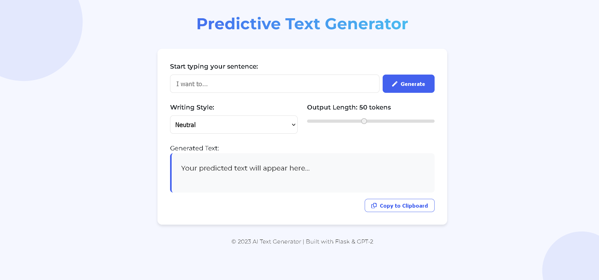
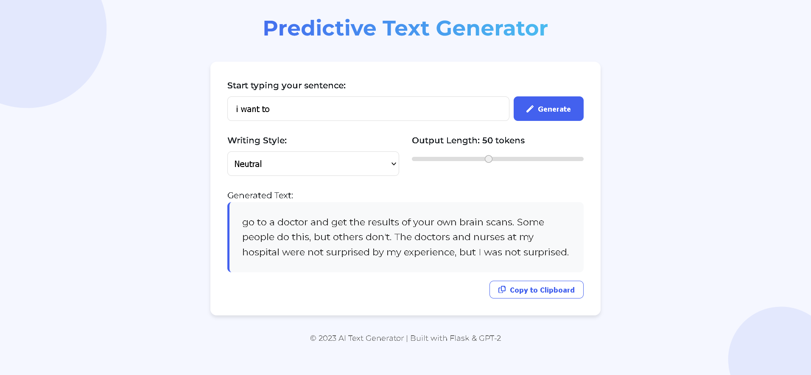

# 🧠 Predictive Text Generator




This project is a **Transformer-based text generation tool** powered by OpenAI's GPT-2 model. It provides a web-based interface for generating contextually relevant sentences, supporting different writing styles and multiple languages.

## 🔧 Features

- ✍️ **Text Prediction**: Generates the next part of a sentence using GPT-2.
- 🎨 **Style Control**: Choose between *neutral*, *casual*, and *formal* tones.
- 🌐 **Multilingual Support**: Accepts inputs in English, Hindi, Tamil, and Kannada.
- 🔄 **Automatic Translation**: Non-English inputs are translated to English for generation, and the output is translated back to the original language.
- ⚡ **Real-time Web UI**:
  - `Flask` backend for REST API (`/generate` endpoint).
  - `Streamlit` frontend for interactive text prediction and language selection.

## 🏗️ Tech Stack

- **Backend**: Flask + Transformers (HuggingFace)
- **Frontend**: Streamlit
- **Model**: GPT-2 (`gpt2` from HuggingFace)
- **Translation**: Helsinki-NLP Opus-MT models
- **Language Detection**: `langdetect`
- **Device Compatibility**: Automatically uses GPU if available (via PyTorch)

## 🚀 Getting Started

### 1. Clone the Repository
```bash
git clone https://github.com/yourusername/predictive-text-generator.git
cd predictive-text-generator
